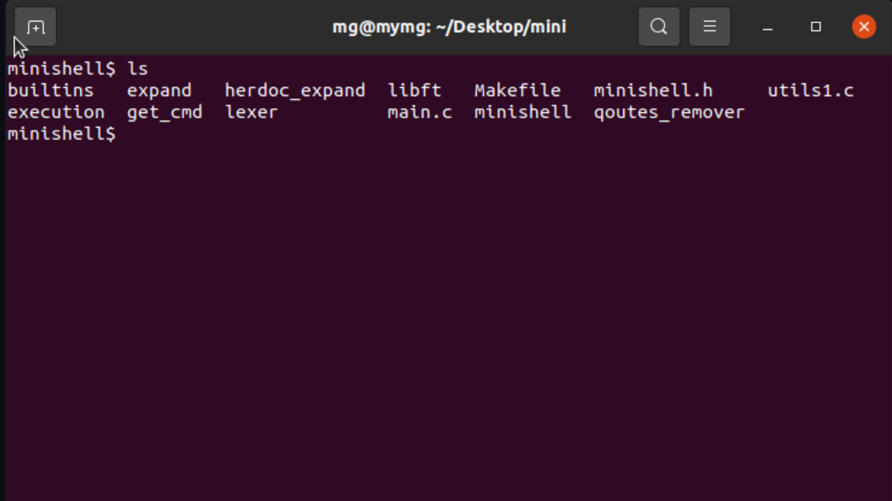

# 🐚 MiniShell - A Simple Shell Like Bash



## What is MiniShell?

MiniShell is a small program that works like the bash shell on your computer. You can type commands and see them run!

This project was made by two students learning how computers work.

## What Did I Learn?

Working on this project taught me:

- **Processes** - How to create and manage running programs
- **System calls** - How programs talk to the operating system
- **Files** - How to open, read, and write files
- **Heredoc** - How to take multiple lines of input (`<< EOF`)
- **Pipes** - How to make commands talk to each other (`|`)
- **Signals** - How to handle Ctrl+C, Ctrl+D, and Ctrl+\
- **Kernel** - How the system really runs commands

## My Role in the Project

My teammate parses (breaks down) the commands you type. My job is to execute them - make them actually run!

When you type `ls -l`, I:

1. Take the parsed command from my teammate
2. Tell the system to run it
3. Show you the result

## How to Install and Run

Open your terminal and type:

```bash
# Copy the project from GitHub
git clone https://github.com/elghandori1/minishell.git

# Go into the project folder
cd minishell

# Compile the program
make

# Run MiniShell
./minishell
```

## Commands You Can Try

Once MiniShell is running, try these:

```bash
ls                 # List files in current folder
ls -l              # List files with details
pwd                # Show current folder path
echo hello         # Print hello
cat file.txt       # Show what's inside file.txt
wc -l file.txt     # Count lines in file.txt
exit               # Exit MiniShell
```

## Advanced Commands

```bash
ls -l | wc -l      # Count how many files (using pipe)
cat << EOF         # Write multiple lines until you type EOF
> line 1
> line 2
> EOF
sleep 5            # Try Ctrl+C to stop it
```

## Requirements

- Linux or macOS
- GCC compiler
- Make

## Project Structure

```
minishell/
├── builtins/      # Built-in commands (cd, echo, etc.)
├── execution/     # Command execution logic
├── expand/        # Variable expansion
├── get_cmd/       # Command parsing
├── herdoc_expand/ # Heredoc expansion
├── lexer/         # Lexical analysis
├── libft/         # Custom library
├── quotes_remover/# Quote handling
├── main.c         # Entry point
├── Makefile       # Compilation rules
└── README         # This file
```

## Team

- **Me** - Command execution (processes, pipes, signals)
- **Teammate** - Command parsing

## Want to Try?

Clone the repo and start typing commands. It's like bash but smaller and made by us! 😊
